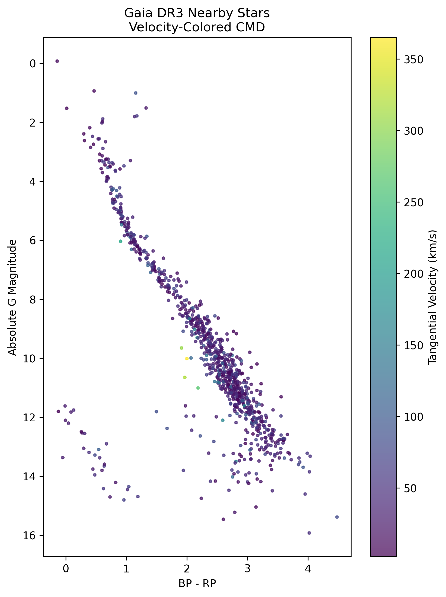

## Gaia Nearby Stars: Photometric and Kinematic Analysis

### Overview

This project investigates the photometric and kinematic properties of nearby stars using Gaia DR3 data. By selecting stars within ~200 pc, I construct a color-magnitude diagram (CMD) and examine how stellar populations separate in both photometric and velocity space.

### Scientific Motivation

Nearby stars provide a clean laboratory for studying Galactic structure. With high signal-to-noise parallaxes, distances can be reliably estimated which allows accurate absolute magnitudes to be computed.
Combining photometry with proper motion measurements allows the construction of tangential velocity distributions which provide a first-order kinematic separation between dynamically cold thin-disk stars and dynamically hot halo candidates.

### Data Selection

Data were retrieved from Gaia DR3 using ADQL via astroquery. Selection criteria:

* Parallax > 5 mas (distance ≲ 200 pc)
* Parallax S/N > 10
* Valid G, BP, and RP photometry

### Methods

* Distance computed via parallax inversion (valid for high-SNR sample)
* Absolute magnitudes calculated using distance modulus
* Tangential velocities derived from proper motions
* Constructed CMD (M_G vs BP-RP)
* Investigated velocity distributions to identify disk vs halo populations

### Results

After applying quality cuts (parallax > 5 mas and S/N > 10), the final working sample contains 859 stars within ~200 pc.

#### Photometric Structure

The standard color-magnitude diagram (CMD) shows a well-defined main sequence extending from:

- Blue luminous stars (low BP-RP, low M_G)
- To red low-luminosity stars (high BP-RP, high M_G)

This morphology is consistent with stellar structure theory where main-sequence position is primarily determined by stellar mass. The dominance of faint red stars reflects the initial mass function (IMF) which favors low-mass star formation. A small population of evolved stars appears above the main sequence, likely corresponding to subgiants and red giants.

#### Kinematics

Tangential velocities were computed using: $v_t=4.74\mu/\varpi$

The resulting velocity stats are:

- Mean tangential velocity: 38.95 km/s
- Velocity dispersion: 29.58 km/s

The velocity distribution is strongly disk-dominated, with:

- 832 stars classified as disk ($v_t$ ≤ 100 km/s)
- 27 high-velocity candidates ($v_t$ > 100 km/s)

These high-velocity outliers are consistent with potential halo stars which are dynamically hotter and exhibit larger velocity dispersions than thin-disk populations.

#### Velocity-Colored CMD

Color-coding the CMD by tangential velocity reveals that:

- The bulk of the main sequence is composed of low-velocity stars consistent with the Galactic thin disk
- High-velocity stars are sparsely distributed and do not cluster in a distinct photometric region

This suggests that kinematic separation is more diagnostic than photometric separation when distinguishing disk and halo populations in the solar neighborhood.

### Tools Used

* Python
* numpy
* matplotlib
* astroquery
* astropy

### Future Work

* Incorporate radial velocities where available
* Apply extinction corrections
* Implement probabilistic disk–halo classification using full 3D velocity vectors where radial velocities are available
* Fit main-sequence locus parametrically
