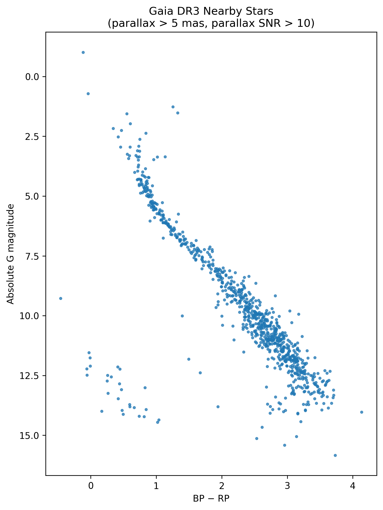

## Gaia Nearby Stars: Photometric and Kinematic Analysis

### Overview

This project investigates the photometric and kinematic properties of nearby stars using Gaia DR3 data. By selecting stars within ~200 pc, I construct a color-magnitude diagram (CMD) and examine how stellar populations separate in both photometric and velocity space.

### Scientific Motivation

Nearby stars provide a clean laboratory for studying Galactic structure. With high signal-to-noise parallaxes, distances can be reliably estimated which allows accurate absolute magnitudes to be computed. Combining photometry with proper motion measurements enables separation of thin disk and halo populations through tangential velocity analysis.

### Data Selection

Data were retrieved from Gaia DR3 using ADQL via astroquery. Selection criteria:

* Parallax > 5 mas (distance ≲ 200 pc)
* Parallax S/N > 10
* Valid G, BP, and RP photometry

### Methods

* Distance computed via parallax inversion (valid for high-SNR sample)
* Absolute magnitudes calculated using distance modulus
* Tangential velocities derived from proper motions
* Constructed CMD (M_G vs BP-RP)
* Investigated velocity distributions to identify disk vs halo populations

### Results

* Well-defined main sequence observed
* Clear separation of stellar populations in velocity space
* High-velocity outliers consistent with potential halo stars

### Tools Used

* Python
* numpy
* matplotlib
* astroquery
* astropy

### Future Work

* Incorporate radial velocities where available
* Apply extinction corrections
* Quantify disk/halo separation using velocity cuts
* Fit main-sequence locus parametrically
